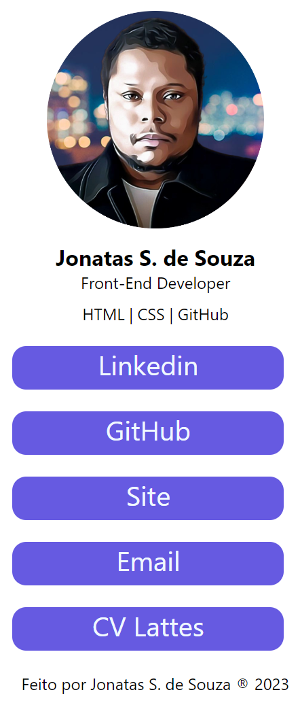

# My Links

Development of a website that presents a page with links to social networks.

 - Semantic HTML was used to develop the structure of the website. 
 - style the appearance of HTML elements in a responsive layout.

<!-- />-->
<!-- -->

<<<<<<< HEAD

[def]: /assets/image/my-links.png
=======

>>>>>>> c81dc0b9549ea98b8ee1d373551081b267d72178
